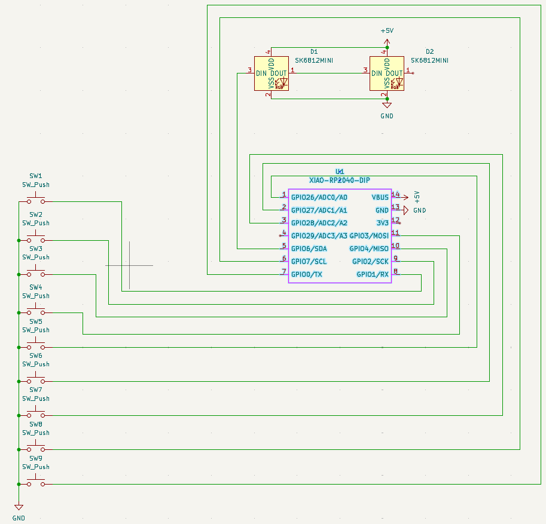
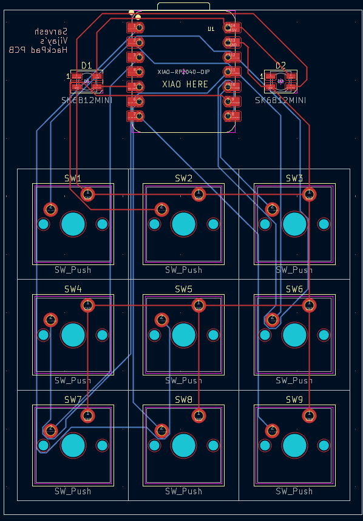
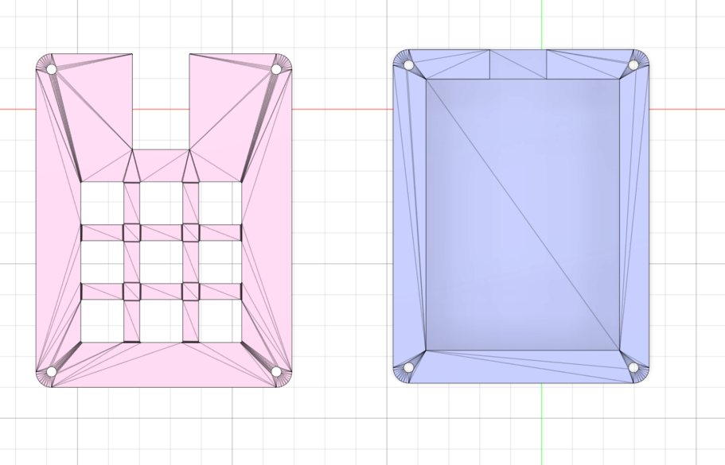

# My 9‑Key Macropad  
Done your hackpad? Congrats! This is my submission for a custom 9‑key macropad built using the XIAO RP2040, Cherry‑style switches, and a fully custom PCB + case.

---

### Inspiration

I wanted to create a macropad that was both functional and clean — something I could use every day for shortcuts, media controls, and quick actions. Designing the PCB, case, and firmware myself made the whole project feel like a complete end‑to‑end build.

---

### Challenges

This project pushed me in a few areas:

- Getting the PCB routed neatly in KiCad  
- Making sure the XIAO RP2040 pinout matched my switch wiring  
- Learning how to model and align everything in Fusion 360  
- Ensuring the case fit perfectly around the PCB, switches, and USB port  

Even with the challenges, I’m proud of how polished the final macropad turned out.

---

### Specifications

**BOM:**  
- 9× Cherry MX‑style switches  
- 1× XIAO RP2040  
- 9× Keycaps  
- 2× SK6812 MINI LEDs  
- 4× M3x16 bolts  
- 4× M3 heatsets  

**Others:**  
- KMK Firmware  
- `main.py`  
- Top Case `.stl`  
- Bottom Case `.stl`  
- KiCad Schematic  
- KiCad PCB  

---

Schematic | PCB | Case
:-------------------------:|:-------------------------:|:-------------------------:
 |  | 

---
